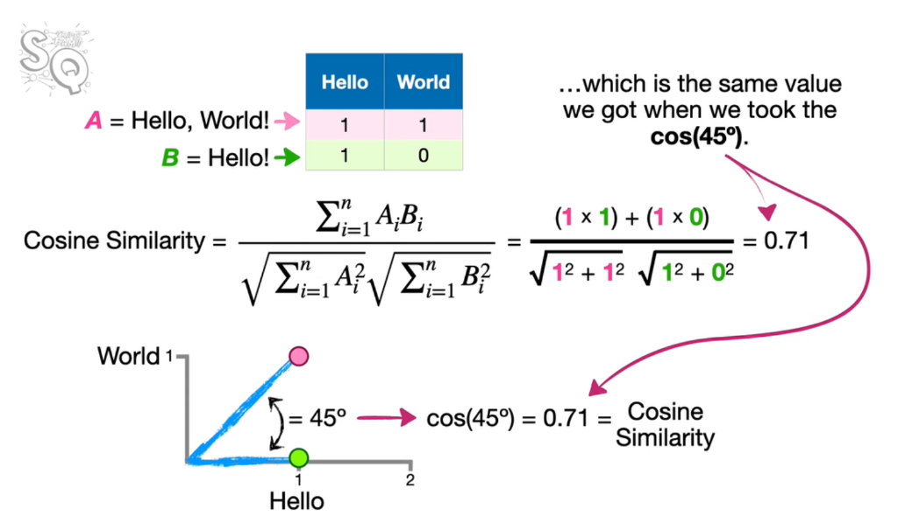
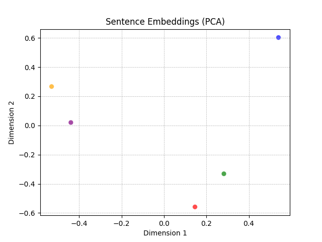
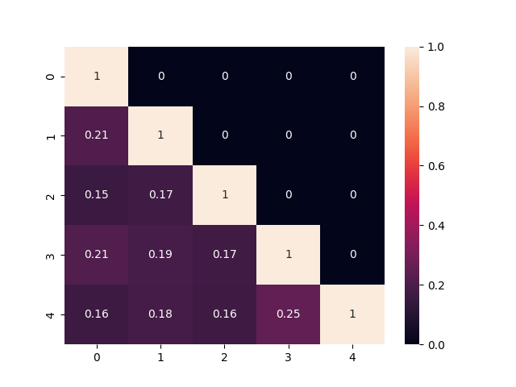
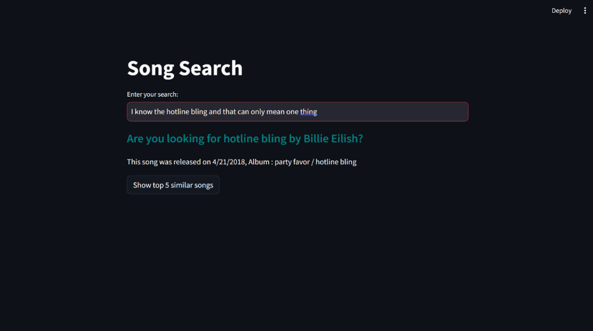
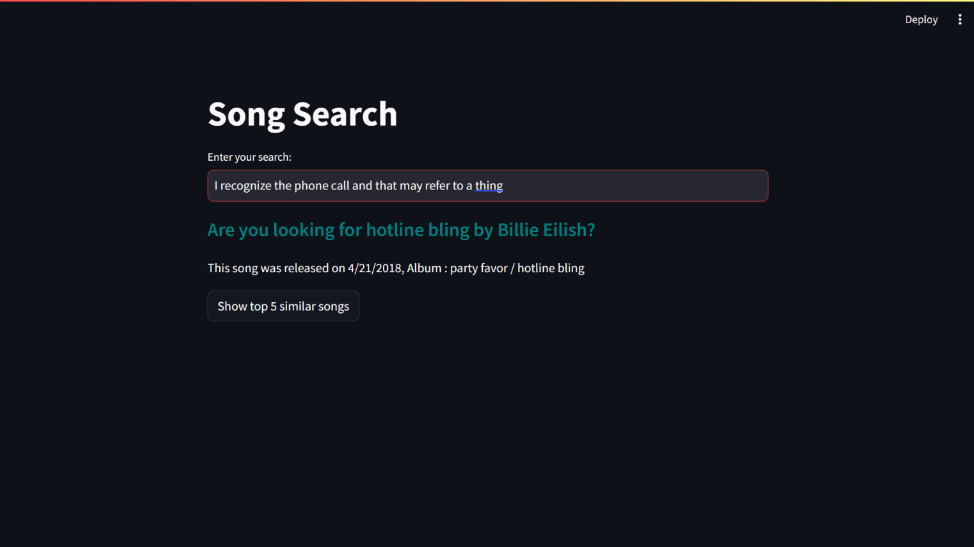

# 🎶Song Lyrics Similarity Search

This project is a song lyrics similarity search application. It allows users to enter a song query, and the app finds similar songs based on the cosine similarity of their lyrics embeddings.

---

## Lyrics Preprocessing

The application expects a CSV file named *data.csv* containing song data including columns like: `Title` `Artist` `Album` `Lyric` `Date`

The `preprocessing.py` script defines a function `preprocess_text` that performs the following steps on song lyrics:

1. Converts text to lowercase.
2. Removes punctuation and special characters except for alphanumeric characters and whitespace.
3. Tokenizes the text into words.
4. Removes stop words from the English language (e.g., "the", "a", "is").
5. Applies stemming to reduce words to their base forms (e.g., "running" becomes "run").

---

## Embedding Lyrics

**Cosine Similarity:**
The `CosineSimilarity` class calculates the cosine similarity between two sentence embeddings. Cosine similarity ranges from -1 to 1, where higher values indicate more similar sentences.

I implemented it myself with NumPy in `embed.py`.



**Embedding Generation:**
The `main.py` script loads the pre-trained sentence transformer model and uses it to generate embeddings for all song lyrics in the `data.csv` file. These embeddings capture the semantic similarity between lyrics.

*Here is a visualization of 5 different songs empeddings with PCA and confusion matrix*


---

## Search

The `app.py` script builds the Streamlit application. When a user enters a song query, it generates an embedding for the query and calculates cosine similarities with all the song embeddings in the data.

The application displays the most similar song based on the highest cosine similarity score. Additionally, it allows users to find the top K most similar songs by clicking a button.




---

## Running the Application

1. Install the required libraries using pip:

   ```bash
   pip install pandas numpy streamlit sentence-transformers nltk
   ```

2. Download the pre-trained sentence transformer model (`all-mpnet-base-v2`) from [Hugging Face](https://huggingface.co/sentence-transformers/all-mpnet-base-v2). Place the downloaded model files in a folder accessible to your project.

3. Navigate to the project directory then cd src in your terminal and Run the app using:

   ```bash
   streamlit run app.py
   ```

This will launch the Streamlit app in your web browser, where you can interact with the song search interface.
